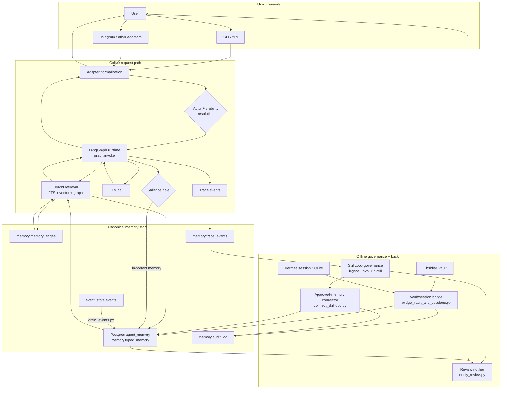
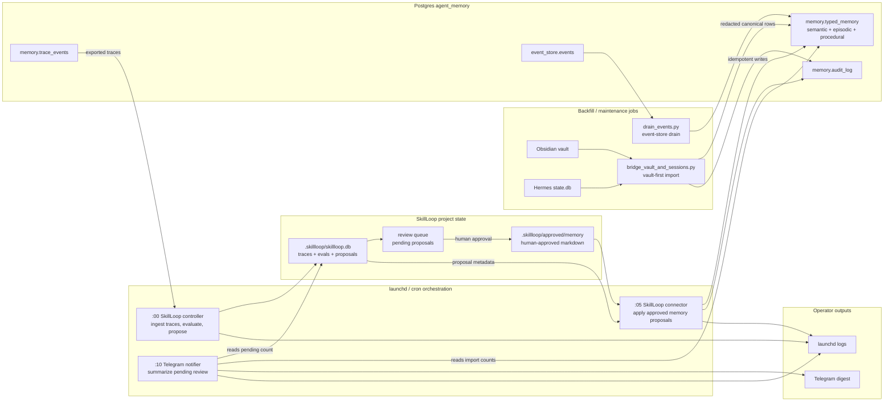

# Agent Architecture

A Python reference runtime for governed AI-agent memory.

It combines LangGraph orchestration, Postgres typed memory, hybrid retrieval,
permission-safe graph expansion, runtime tracing, and a SkillLoop-compatible
trace export boundary.

## What It Does

- Runs an agent request path through `graph.invoke`
- Retrieves context from memory before answering
- Stores durable semantic memory behind a salience gate
- Logs retrieval and diagnostic trace events
- Exports completed turns as SkillLoop-compatible JSONL
- Bridges your Obsidian vault and Hermes chat history into Postgres
- Imports human-reviewed SkillLoop proposals into typed memory
- Notifies you of pending proposals and recent imports

SkillLoop is the governance sidecar: it ingests exported traces, evaluates them,
and proposes reviewed learning artifacts. This runtime remains the canonical
live memory system.

## Architecture



The important boundary is that runtime memory stays inside this repository's
execution path. SkillLoop only consumes exported traces and does not mutate live
memory directly.

## Full-System Pipeline



The three hourly jobs (controller, bridge, notifier) are designed to run via
`launchd` on macOS or `cron` on Linux. They are stateless, idempotent, and
read their configuration from environment variables.

## Request Lifecycle

```mermaid
sequenceDiagram
    autonumber
    actor User
    participant Adapter as Adapter / channel
    participant Identity as Identity resolver
    participant Graph as LangGraph runtime
    participant Retrieval as Hybrid retrieval
    participant Store as Postgres memory
    participant Model as LLM
    participant Trace as Trace recorder
    participant SkillLoop as SkillLoop sidecar

    User->>Adapter: send message
    Adapter->>Identity: normalize channel + actor
    Identity-->>Adapter: actor_id, org_id, visibility scope
    Adapter->>Graph: invoke(input, scoped identity)
    Graph->>Retrieval: request context for current actor/session
    Retrieval->>Store: FTS + vector + graph expansion
    Store-->>Retrieval: permission-filtered ranked context
    Retrieval-->>Graph: compact context bundle
    Graph->>Model: prompt with retrieved context
    Model-->>Graph: answer
    Graph-->>Adapter: final response
    Adapter-->>User: reply

    par durable side effects
        Graph->>Store: salient memory write if gate passes
        Graph->>Trace: trace events + diagnostics
        Trace-->>SkillLoop: exported traces for offline governance
    end

    Note over SkillLoop,Store: SkillLoop proposes changes offline; only approved markdown is imported by the connector.
```

## Repository Layout

```text
src/                         runtime modules, adapters, retrieval, tracing
scripts/
  connect_skillloop.py       SkillLoop-to-Postgres connector (hourly)
  bridge_vault_and_sessions.py  Vault + SQLite bridge (hourly)
  notify_review.py           Telegram notifier (hourly)
  drain_events.py            One-shot event drain helper
examples/export_skillloop_trace.py
event_worker.py              event ingestion worker entrypoint
sync_wiki.py                 wiki sync utility
langgraph_deep_path.py       LangGraph runtime path entrypoint
init_schema.sql              Postgres schema bootstrap
smoke_test.py                public repo hygiene checks
docs/RELEASE_CHECKLIST.md    release readiness checklist
.hermes/                     design docs and loop state
```

## Current Status

This is a local/public reference implementation. It is not a hosted production
service out of the box. Production use still needs deployment-specific identity,
secrets management, monitoring, backup/restore, and RLS regression coverage.

## Quick Start

Run `./install.sh` and follow the prompts. It checks for Python 3.11+,
creates a virtual environment, installs dependencies, sets up Postgres,
writes `.env`, and optionally initializes SkillLoop.

Then verify everything works:

```bash
python -B smoke_test.py
```

## Setup (Manual)

If you prefer to set up manually instead of using `install.sh`:

```bash
python -m venv .venv
source .venv/bin/activate
python -m pip install -r requirements.txt
cp .env.example .env
```

Default local mode does not require Postgres:

```bash
python src/test.py
python -B smoke_test.py
```

Postgres-backed tests require a migrated database and:

```bash
export DATABASE_URL=postgresql:///agent_memory
export MEMORY_BACKEND=postgres
```

The runtime also requires an explicit organization identity for non-test
execution:

```bash
export AGENT_ORG_ID=your_org_id
```

## Add Your Own Identity

The scripts use placeholder defaults. Override them with environment variables:

```bash
export ACTOR_ID="owner:your_handle"
export TELEGRAM_USER_ID="123456789"
```

Or edit the defaults in each script:

| Script | Variable | Default |
|--------|----------|---------|
| `scripts/connect_skillloop.py` | `ACTOR_ID` | `owner:<USER>` |
| `scripts/bridge_vault_and_sessions.py` | `ACTOR_ID` | `owner:<USER>` |
| `scripts/notify_review.py` | `TELEGRAM_USER_ID` | `<TELEGRAM_USER_ID>` |

## Embeddings

Local embeddings are preferred and enabled by default:

```text
EMBEDDING_PROVIDER=local
LOCAL_EMBEDDING_MODEL=all-MiniLM-L6-v2
```

API embeddings are optional:

```text
EMBEDDING_PROVIDER=openai
EMBEDDING_API_KEY=...
```

Do not mix embedding providers in one vector table. Regenerate stored embeddings
when changing provider or model.

## SkillLoop Export

Generate a trace JSONL file from a real local runtime turn:

```bash
python examples/export_skillloop_trace.py
```

Then ingest it from a SkillLoop checkout:

```bash
skillloop --path /path/to/project ingest agent-architecture examples/out/sample_runtime_turn_trace.jsonl
```

The export is read-only governance data. SkillLoop does not write directly into
runtime memory.

Full walkthrough: `docs/SKILLLOOP_INGEST_EXAMPLE.md`.

## Validation

Fast validation:

```bash
python -B smoke_test.py
python -B -m pytest -p no:cacheprovider src/test_trace_export.py src/test_adapters.py -q
```

Full local validation:

```bash
python -B -m pytest -p no:cacheprovider src -q
python -B smoke_test.py
```

## Public Release Checks

Before pushing to GitHub:

```bash
python -B -m pytest -p no:cacheprovider src -q
python -B smoke_test.py
```

Also run the checklist in `docs/RELEASE_CHECKLIST.md`.

## Hourly Jobs (launchd / cron)

### 1. SkillLoop Controller

Reads approved SkillLoop proposals and writes them into Postgres.

```xml
<!-- com.agent_architecture.controller.plist -->
<?xml version="1.0" encoding="UTF-8"?>
<!DOCTYPE plist PUBLIC "-//Apple//DTD PLIST 1.0//EN" "http://www.apple.com/DTDs/PropertyList-1.0.dtd">
<plist version="1.0">
<dict>
    <key>Label</key>
    <string>com.agent_architecture.controller</string>
    <key>ProgramArguments</key>
    <array>
        <string>&lt;PYTHON_PATH&gt;</string>
        <string>&lt;HOME&gt;/agent_architecture/scripts/connect_skillloop.py</string>
    </array>
    <key>StartCalendarInterval</key>
    <dict>
        <key>Minute</key>
        <integer>0</integer>
    </dict>
    <key>EnvironmentVariables</key>
    <dict>
        <key>DATABASE_URL</key>
        <string>postgresql:///agent_memory</string>
        <key>ACTOR_ID</key>
        <string>owner:&lt;USER&gt;</string>
    </dict>
    <key>StandardOutPath</key>
    <string>&lt;HOME&gt;/Library/Logs/com.agent_architecture.controller.log</string>
    <key>StandardErrorPath</key>
    <string>&lt;HOME&gt;/Library/Logs/com.agent_architecture.controller.err</string>
</dict>
</plist>
```

Load:

```bash
launchctl bootstrap gui/$(id -u) ~/Library/LaunchAgents/com.agent_architecture.controller.plist
```

### 2. Vault Bridge

Imports Obsidian vault facts and Hermes session evidence into Postgres.

```xml
<!-- com.agent_architecture.bridge.plist -->
<?xml version="1.0" encoding="UTF-8"?>
<!DOCTYPE plist PUBLIC "-//Apple//DTD PLIST 1.0//EN" "http://www.apple.com/DTDs/PropertyList-1.0.dtd">
<plist version="1.0">
<dict>
    <key>Label</key>
    <string>com.agent_architecture.bridge</string>
    <key>ProgramArguments</key>
    <array>
        <string>&lt;PYTHON_PATH&gt;</string>
        <string>&lt;HOME&gt;/agent_architecture/scripts/bridge_vault_and_sessions.py</string>
        <string>--mode</string>
        <string>incremental</string>
    </array>
    <key>StartCalendarInterval</key>
    <dict>
        <key>Minute</key>
        <integer>5</integer>
    </dict>
    <key>EnvironmentVariables</key>
    <dict>
        <key>DATABASE_URL</key>
        <string>postgresql:///agent_memory</string>
        <key>ACTOR_ID</key>
        <string>owner:&lt;USER&gt;</string>
    </dict>
    <key>StandardOutPath</key>
    <string>&lt;HOME&gt;/Library/Logs/com.agent_architecture.bridge.log</string>
    <key>StandardErrorPath</key>
    <string>&lt;HOME&gt;/Library/Logs/com.agent_architecture.bridge.err</string>
</dict>
</plist>
```

Load:

```bash
launchctl bootstrap gui/$(id -u) ~/Library/LaunchAgents/com.agent_architecture.bridge.plist
```

### 3. Notifier

Sends a Telegram digest of pending proposals and recent imports.

```xml
<!-- com.agent_architecture.notify.plist -->
<?xml version="1.0" encoding="UTF-8"?>
<!DOCTYPE plist PUBLIC "-//Apple//DTD PLIST 1.0//EN" "http://www.apple.com/DTDs/PropertyList-1.0.dtd">
<plist version="1.0">
<dict>
    <key>Label</key>
    <string>com.agent_architecture.notify</string>
    <key>ProgramArguments</key>
    <array>
        <string>&lt;PYTHON_PATH&gt;</string>
        <string>&lt;HOME&gt;/agent_architecture/scripts/notify_review.py</string>
    </array>
    <key>StartCalendarInterval</key>
    <dict>
        <key>Minute</key>
        <integer>10</integer>
    </dict>
    <key>EnvironmentVariables</key>
    <dict>
        <key>DATABASE_URL</key>
        <string>postgresql:///agent_memory</string>
        <key>TELEGRAM_USER_ID</key>
        <string>&lt;TELEGRAM_USER_ID&gt;</string>
    </dict>
    <key>StandardOutPath</key>
    <string>&lt;HOME&gt;/Library/Logs/com.agent_architecture.notify.log</string>
    <key>StandardErrorPath</key>
    <string>&lt;HOME&gt;/Library/Logs/com.agent_architecture.notify.err</string>
</dict>
</plist>
```

Load:

```bash
launchctl bootstrap gui/$(id -u) ~/Library/LaunchAgents/com.agent_architecture.notify.plist
```

### Linux cron equivalent

```cron
# SkillLoop controller — top of every hour
0 * * * * DATABASE_URL=postgresql:///agent_memory ACTOR_ID=owner:<USER> <PYTHON_PATH> <HOME>/agent_architecture/scripts/connect_skillloop.py >> <HOME>/logs/controller.log 2>&1

# Vault bridge — 5 minutes past every hour
5 * * * * DATABASE_URL=postgresql:///agent_memory ACTOR_ID=owner:<USER> <PYTHON_PATH> <HOME>/agent_architecture/scripts/bridge_vault_and_sessions.py --mode incremental >> <HOME>/logs/bridge.log 2>&1

# Notifier — 10 minutes past every hour
10 * * * * DATABASE_URL=postgresql:///agent_memory TELEGRAM_USER_ID=<TELEGRAM_USER_ID> <PYTHON_PATH> <HOME>/agent_architecture/scripts/notify_review.py >> <HOME>/logs/notify.log 2>&1
```

## Design Docs

- `.hermes/BRIDGE_DESIGN.md` — Vault-first bridge design
- `.hermes/SKILLOOP_CONNECTOR_DESIGN.md` — SkillLoop connector design
- `.hermes/ENTERPRISE_DIFFERENCES.md` — MVP vs multi-tenant gap analysis
- `.hermes/PERSONAL_USE.md` — Single-user build scope
- `docs/internal/STATE.md` — Internal development log (not for public use)

## Project Policy

- Contribution guide: `CONTRIBUTING.md`
- Security reporting: `SECURITY.md`
- License: `LICENSE`
