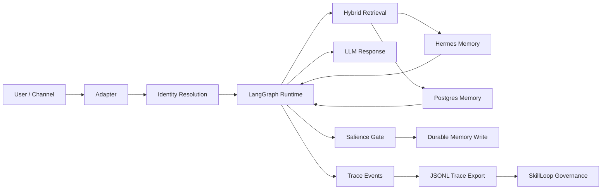
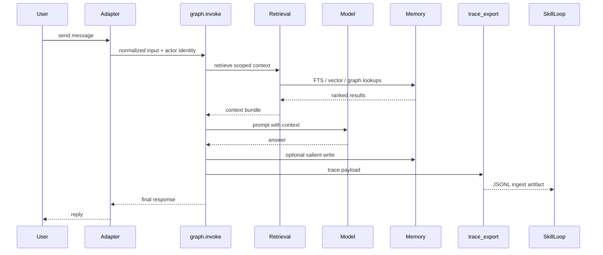

# Agent Architecture

A Python reference runtime for governed AI-agent memory.

It combines LangGraph orchestration, Postgres typed memory, hybrid retrieval,
permission-safe graph expansion, runtime tracing, and a SkillLoop-compatible
trace export boundary.

## What It Does

- Runs an agent request path through `graph.invoke`
- Retrieves context from memory before answering
- Stores durable semantic memory behind a salience gate
- Logs retrieval and diagnostic trace events
- Exports completed turns as SkillLoop-compatible JSONL

SkillLoop is the governance sidecar: it ingests exported traces, evaluates them,
and proposes reviewed learning artifacts. This runtime remains the canonical
live memory system.

## Architecture



The important boundary is that runtime memory stays inside this repository's
execution path. SkillLoop only consumes exported traces and does not mutate live
memory directly.

## Request Lifecycle



## Repository Layout

```text
src/                         runtime modules, adapters, retrieval, tracing
examples/export_skillloop_trace.py
event_worker.py              event ingestion worker entrypoint
sync_wiki.py                 wiki sync utility
langgraph_deep_path.py       LangGraph runtime path entrypoint
init_schema.sql              Postgres schema bootstrap
smoke_test.py                public repo hygiene checks
docs/RELEASE_CHECKLIST.md    release readiness checklist
```

## Current Status

This is a local/public reference implementation. It is not a hosted production
service out of the box. Production use still needs deployment-specific identity,
secrets management, monitoring, backup/restore, and RLS regression coverage.

## Setup

```bash
python -m venv .venv
source .venv/bin/activate
python -m pip install -r requirements.txt
cp .env.example .env
```

Default local mode does not require Postgres:

```bash
python src/test.py
python -B smoke_test.py
```

Postgres-backed tests require a migrated database and:

```bash
export DATABASE_URL=postgresql:///agent_memory
export MEMORY_BACKEND=postgres
```

The runtime also requires an explicit organization identity for non-test
execution:

```bash
export AGENT_ORG_ID=your_org_id
```

## Embeddings

Local embeddings are preferred and enabled by default:

```text
EMBEDDING_PROVIDER=local
LOCAL_EMBEDDING_MODEL=all-MiniLM-L6-v2
```

API embeddings are optional:

```text
EMBEDDING_PROVIDER=openai
EMBEDDING_API_KEY=...
```

Do not mix embedding providers in one vector table. Regenerate stored embeddings
when changing provider or model.

## SkillLoop Export

Generate a trace JSONL file from a real local runtime turn:

```bash
python examples/export_skillloop_trace.py
```

Then ingest it from a SkillLoop checkout:

```bash
skillloop --path /path/to/project ingest agent-architecture examples/out/sample_trace.jsonl
```

The export is read-only governance data. SkillLoop does not write directly into
runtime memory.

Full walkthrough: `docs/SKILLLOOP_INGEST_EXAMPLE.md`.

## Validation

Fast validation:

```bash
python -B smoke_test.py
python -B -m pytest -p no:cacheprovider src/test_trace_export.py src/test_adapters.py -q
```

Full local validation:

```bash
python -B -m pytest -p no:cacheprovider src -q
python -B smoke_test.py
```

## Public Release Checks

Before pushing to GitHub:

```bash
python -B -m pytest -p no:cacheprovider src -q
python -B smoke_test.py
```

Also run the checklist in `docs/RELEASE_CHECKLIST.md`.

## Project Policy

- Contribution guide: `CONTRIBUTING.md`
- Security reporting: `SECURITY.md`
- License: `LICENSE`
